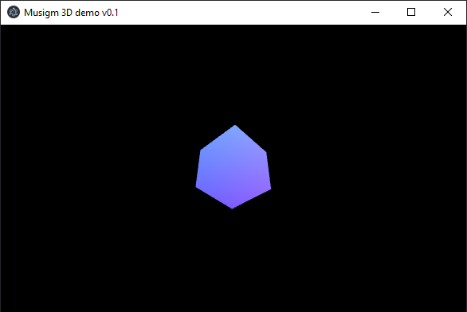

# musigm-js

### What is this ? ####

I'm a young programmer how is learning at school.
I had an idea: create my own game engine to create my games, so I can say the game is 100% from me hahaha.

I'm glad I am able to show you my code.

Musigm is a 3D game engine exactly like THREE.js, but it's mine so it's better ;P.

### How to use musigm-js ? ###
Let's start doing our shit !

Create a simple .html file and a .js file :

index.html:
```html
<script type='module'>
    <!-- our code should be here -->
    <!-- but because I'm not a noob, let's create an other file -->
</script>
```

Main.js:
```javascript
// this is the best part ! 
// start by creating your Main class like this :

// these are the imports, vscode is making them by default so you don't have to worry about them :D
import { Scene } from "musigm-3d-v0.0.1/src/js/core/Scene.js";
import { Camera } from "musigm-3d-v0.0.1/src/js/core/Camera.js";
import { GameObject } from "musigm-3d-v0.0.1/src/js/core/GameObject.js";
import { Material } from "musigm-3d-v0.0.1/src/js/core/component/Material.js";
import { Mesh } from "musigm-3d-v0.0.1/src/js/core/component/Mesh.js";

export class Main{
    /**
     * Main class
     */
    constructor(){
        // create a scene
        const scene = new Scene();

        // create a camera
        const camera = new Camera();

        // create a gameObjects & add it the scene
        let myCube = new GameObject();
        scene.add(myCube);

        // add him a mesh and a material so we can render it
        let myMesh = myCube.addComponent(Mesh);
        let myMaterial = myCube.addComponent(Material);

        // apply shitty transformations to the object ahha
        camera.position.z = -10;
        myCube.rotation.y = 45;
        myCube.rotation.x = 45;
        
        function loop() {

            // other transformations so it looks nice 
            myCube.rotation.y += 0.5;
            myCube.rotation.x += 0.5;

            // ask the camera to render the scene
            camera.render(scene);

            requestAnimationFrame(loop.bind(this));
        }
        loop();
    }
}

```
#### Output ####


### Advices ###
I strongly recommends you to use musigm to create small games for now, I'm still a beginner so my code is not 100% perfect and if something is marked as deprecaded, do not use it !

If you have any suggestions, please tell me and I would change the code :D.