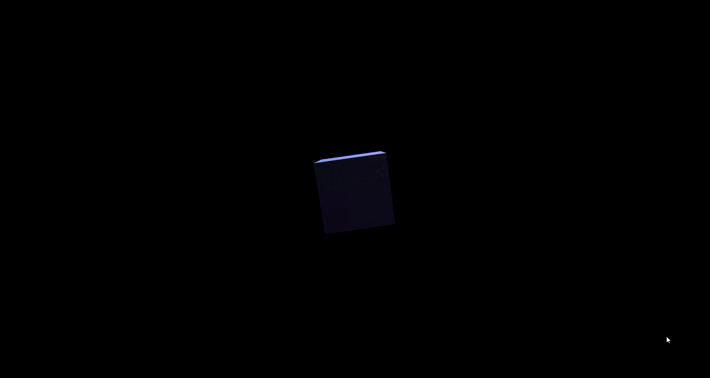

# musigm-js

### What is this ? ####

I'm a young programmer who is learning at school.
I had an idea: create my own game engine to create my games, so I can say the game is 100% from me hahaha.

I'm glad I am able to show you my code.

Musigm is a 3D game engine exactly like THREE.js, but it's mine so it's better ;P.

### How to use musigm-js ? ###
Let's start doing our shit !

Create a simple .html file and a .js file :

index.html:
```html
<script type='module'>
    <!-- our code should be here -->
    <!-- but because I'm not a noob, let's create an other file -->
</script>
```

Main.js:
```javascript
// this is the best part ! 
// start by creating your Main class like this :

// these are the imports, vscode is making them by default so you don't have to worry about them :D
import { Scene } from "../../../../musigm-3d-v0.0.1/src/js/core/Scene.js";
import { Camera } from "../../../../musigm-3d-v0.0.1/src/js/core/Camera.js";
import { GameObject } from "../../../../musigm-3d-v0.0.1/src/js/core/GameObject.js";
import { DirectionLight } from "../../../src/js/core/component/DirectionLight.js";
import { Material } from "../../../../musigm-3d-v0.0.1/src/js/core/component/Material.js";
import { Mesh } from "../../../../musigm-3d-v0.0.1/src/js/core/component/Mesh.js";

export class Main{
    /**
     * @Saumon-cru  
     */
    constructor(){
        // scene
        let scene = new Scene();

        // camera
        let camera = new Camera();
        camera.position.z = -10.0;

        // direction light
        let directionLight = new GameObject();
        directionLight.addComponent(DirectionLight);

        // cube
        let cube = new GameObject();
        cube.addComponent(Mesh);
        cube.addComponent(Material);
        
        // add all your objects to the scene
        scene.add(directionLight, cube);

        function loop() {

            // rotate the cube
            cube.rotation.x += 0.5;
            cube.rotation.y += 0.5;

            // render
            camera.render(scene);

            requestAnimationFrame(loop.bind(this));
        }
        loop();
    }
}

new Main();

```

#### Output ####


### Advices ###
I strongly recommends you to use musigm to create small games for now, I'm still a beginner so my code is not 100% perfect and if something is marked as deprecaded, do not use it !

If you have any suggestions, please tell me and I would change the code :D.

### Patch Note ###
For those who are interested hehe, I'm working a lot on the default shaders, I making some lights for now : 


I'm getting this light effect by calculating the dot product between the vector "light to face" and the normal from this same faces.
The problem I have is that my normals are not well calculated so the result is not really good.