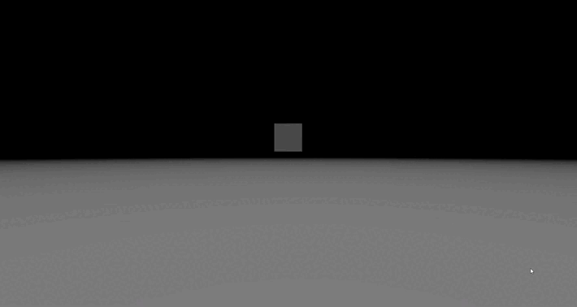

# musigm-js

### What is this ? ####

I'm a young 16yo student who is learning at school.
I had an idea: create my own game engine framework to create my games, so I can say the game is 100% from me hahaha.

I'm glad I am able to show you my code.

Musigm is an open-gl based library to create 3D games, there will be web-gpu support in the future.

### How to use musigm-js ? ###
Let's start doing our shit !

Create a simple .html file and a .js file :

#### index.html: ####
```html
<script type='module'>
    <!-- our code should be here -->
    <!-- but because I'm not a noob, let's create an other file -->
</script>
```

#### Main.js: ####
```javascript
// this is the best part ! 
// start by creating your Main class like this :

// these are the imports, vscode is making them by default so you don't have to worry about them :D
import { Scene } from "musigm-3d-v0.0.1/src/js/core/Scene.js";
import { Camera } from "musigm-3d-v0.0.1/src/js/core/Camera.js";
import { GameObject } from "musigm-3d-v0.0.1/src/js/core/GameObject.js";
import { DirectionLight } from "musigm-3d-v0.0.1/src/js/core/component/DirectionLight.js";
import { Material } from "musigm-3d-v0.0.1/src/js/core/component/Material.js";
import { Mesh } from "musigm-3d-v0.0.1/src/js/core/component/Mesh.js";

export class Main{
    /**
     * @Saumon-cru  
     */
    constructor(){
        // scene
        let scene = new Scene();

        // camera
        let camera = new Camera();
        camera.position.z = -10.0;

        // direction light
        let directionLight = new GameObject();
        directionLight.addComponent(DirectionLight);

        // cube
        let cube = new GameObject();
        cube.addComponent(Mesh);
        cube.addComponent(Material);
        
        // add all your objects to the scene
        scene.add(directionLight, cube);

        function loop() {

            // rotate the cube
            cube.rotation.x += 0.5;
            cube.rotation.y += 0.5;

            // render
            camera.render(scene);

            requestAnimationFrame(loop.bind(this));
        }
        loop();
    }
}

new Main();
```


#### Output ####


### Patch Note ###
--------------------------------------------------------------------------------------------------------------------------------
#### 15/06/2022 ####
Yesss! 
You can now use .obj files.


It's still a bit slow so it still needs some work, but it's there hehe !

```javascript
let path = "./path/in/your/computer";

OBJLoader.load(path, function(mesh){
    return mesh;
});
```
--------------------------------------------------------------------------------------------------------------------------------
#### 14/06/2022 ####
Yo ! 
New Shader system ! 

just use : 

```javascript
let object = new GameObject();
let material = object.addComponent(Material);

material.fragmentShaderSource; // there, you will find a lot of pre-made functions
// so you just need to create a simple .fs file with your main() and add it like this : 
material.useShader(`
void main() {
    vec3 color = material.color;

    color = computeLight(color);
    color = computeDepthColor(color);
    
    gl_FragColor = vec4(color, 1.0);
}
`);

```

I'm now working on a system to import 3D models from your computer


But it still need some work hahah

--------------------------------------------------------------------------------------------------------------------------------
#### 12/06/2022 ####
Hey ! I come back 1 month after the last note.

Sadly I did not work a lot on new things in this project during this time, however I've fixed a lot of bugs from lighting and 
shitty normals ^^.


I'm currently making a new system for shaders rendering, it's not completely done for now but I can show you how it will work !

```javascript
let object = new GameObject();
let material = object.addComponent(Material);

material.fragmentShaderSource; // there, you will find a lot of pre-made functions
// so you just need to create a simple .fs file with your main() and add it like this : 
material.useShader(`
void main()
{
    vec3 result = vec3(1.0, 1.0, 1.0);

    result = computeDirectionalLightColor(result);
    result = computePointLightColor(result);
    result = computeDepthColor(result);
    
    gl_FragColor = vec4(result, 1.0);
}
`);

// something like that, of course that wont work for now
// keep it at defaults for now :)
```

Let's finish this note with a .gif


--------------------------------------------------------------------------------------------------------------------------------

#### 10/05/2022 ####
Today I made a lot of optimisation for the CPU, (not GPU for now ...), a lot of quadratic times algorithms have been changed to linear time ones.

Of course there is still a lot of work in the GPU optimisation but it will come soon :D !


--------------------------------------------------------------------------------------------------------------------------------

#### 09/05/2022 ####
Yo ! Finally, there is one more light. 


So to be clear, there is two lights that you can use :

#### Main.js: ####
```javascript
let light = new GameObject();
light.addComponent(Light);

let directionLight = new GameObject();
directionLight.addComponent(DirectionLight);

myScene.add(light, directionLight);
```

Of course, you can simply create a scene without any lights so there will be no shadows etc...
For this new light, I've created 3 more parameters : 

```javascript
Light.constant;
Light.linear;
Light.quadratic;
```

These are used to calculate the attenuation of the light :

```javascript
// d = distance between the pixel and the center of the light
A = 1.0 / (Light.constant + Light.linear * d + Light.quadratic * (d ** 2));
```

Next update will be about shadows I think :D ! 


Assuming the axis are like this ;


you may find some wtf values in the demos

--------------------------------------------------------------------------------------------------------------------------------

#### 07/05/2022 ####
New types of lights (directional lights). The defaults shaders are now the ones with the light implementation !
By the way I re wrote the tutorial, there is no more the FPS demo but maybe I will re-write it in the future :D.

I made something cool with scenes and gameObjects, when you link a GameObject with any Scene, you can find that Scene in the current GameObject using GameObject.scenesAttached;

#### Main.js: ####
```javascript
let myScene = new Scene();
let myGameObject = new GameObject();

myScene.add(myGameObject);

console.log(myScene == myGameObject.scenesAttached[0]);
```
#### Output ####
```javascript
true
```

Scene is no more a GameObject, this was an error of mine ahhahah

For the next update, there will be more lights and I hope I will be able to implement cast shadows ...

--------------------------------------------------------------------------------------------------------------------------------

#### 05/05/2022 ####
For those who are interested hehe, I'm working a lot on the default shaders, I making some lights for now : 


I'm getting this light effect by calculating the dot product between the vector "light to face" and the normal from this same faces.
The problem I have is that my normals are not well calculated so the result is not really good.
